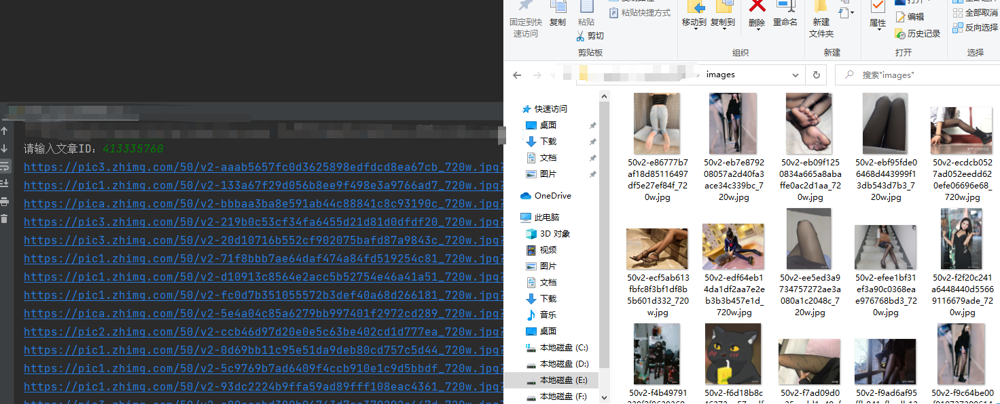

# ~~zhihu_img_download 知乎图片下载小工具~~   2022年2月 **已失效**

## 修复计划
目前正在调试中 = = 

## 安装
    git clone https://github.com/j2ekim/zhihu_img_download
    pip install aiofiles
    pip install aiohttp
    pip install asyncio

## 工具介绍 
  v1.3 修复已知Bug
  
  v1.2 添加异常处理
  
  v1.1 使用多线程异步协程，提高图片下载效率

  
## 说明：
Question ID 即 question后面跟的id
如

https://www.zhihu.com/question/413335760/answer/1447589559

Question ID 为 413335760

